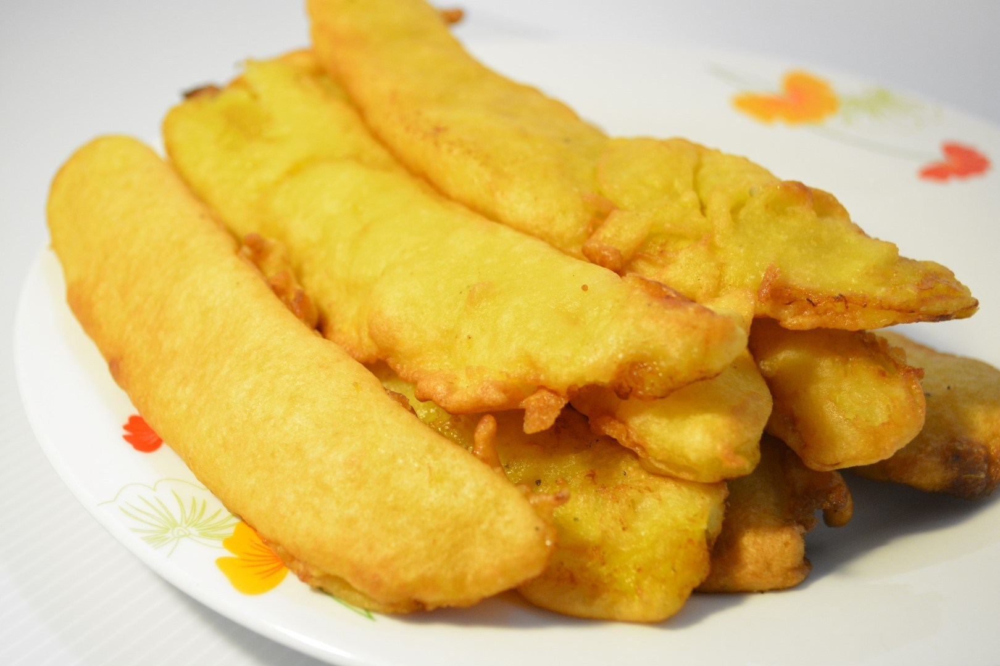

# Introduction
 Banana fry also known as pazham pori or ethakka appam is a fritter food with ripened banana or plantain and maida flour. A popular food item in South Indian cuisines, it is generally eaten as a breakfast or a snack.

 

## Ingredients

1. Banana - 2
2. Sugar -5 tbsp
3. Plain flour- 1 cup
4. Turmeric powder - a pinch
5. Rice flour - 1/2 cup
6. Salt - a pinch
7. Water
8. Coconut oil
9. Baking soda - a pinch

## Instruction

1. Peel the banana, slit it lengthwise and keep it aside.
2. Make a batter with Plain flour, Rice flour, Turmeric powder, Baking soda, Sugar, Salt, Water.
3. Heat the oil in a deep bottom pan. Dip sliced banana in the batter and make sure it is evenly coated. Deep fry it

## Notes
1. Sliced banana should be thick enough for frying.
2. Turmeric powder should not be more than a pinch. Purpose is only for getting color rather than adding permitted food color.
3. While adding banana, flame should be high.

